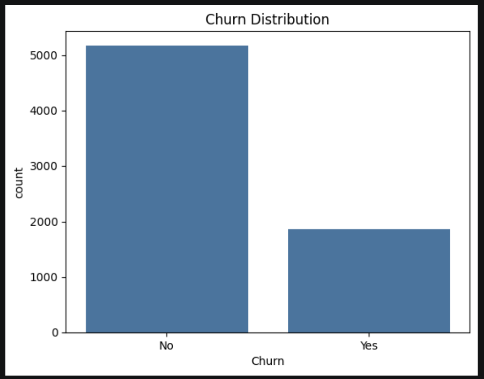
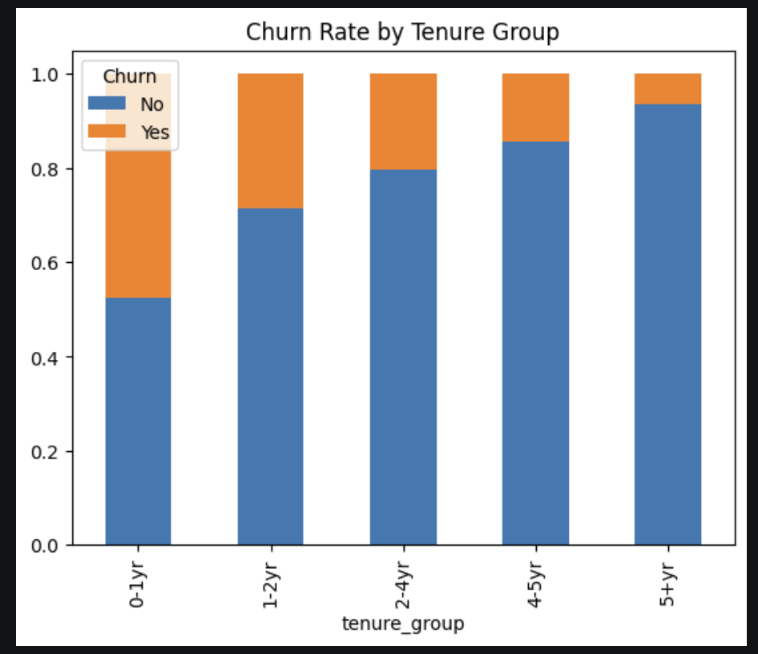
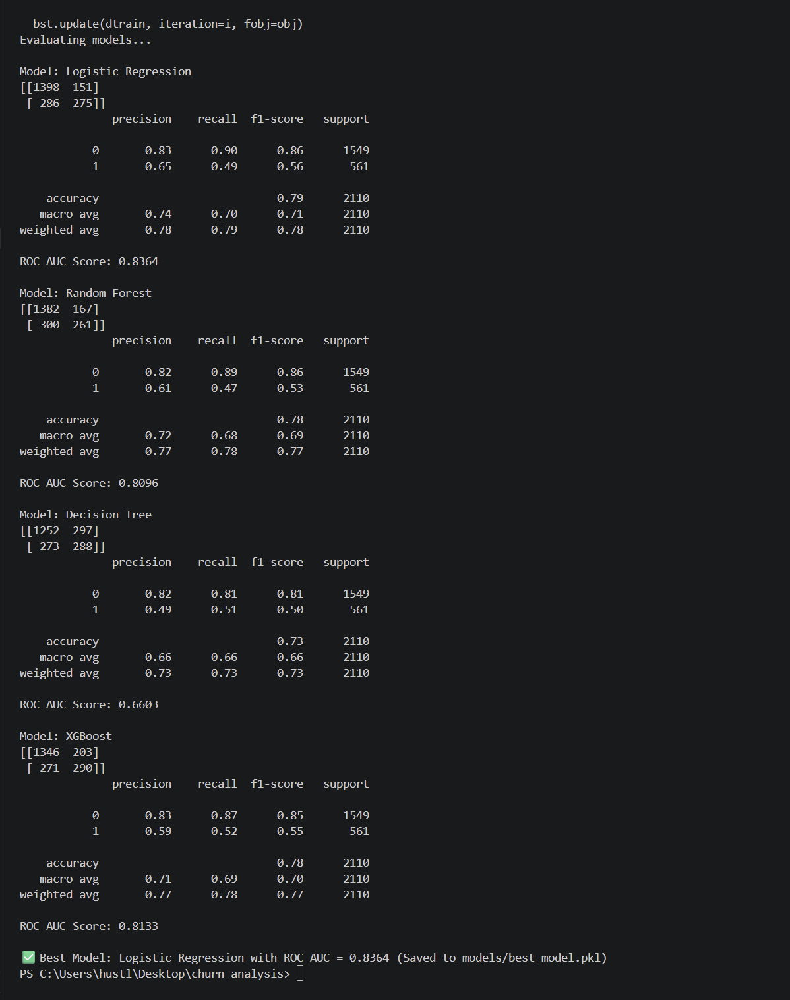

# 📊 Customer Churn Analysis - Machine Learning Project

This project predicts customer churn using machine learning models and analyzes customer behavior using SQL, Python, and data visualization techniques. It follows an end-to-end pipeline from data preprocessing to model evaluation.

---

## 🚀 Project Overview

Customer churn is a critical business problem where companies aim to identify customers likely to leave. This project builds a predictive model and derives insights to improve retention strategies.

---

## 📁 Folder Structure

churn_analysis/
│
├── data/
│   ├── churn_analysis.csv
│   └── cleaned_churn.csv
│
├── src/
│   ├── data_loader.py
│   ├── preprocessing.py
│   ├── model.py
│   └── evaluation.py
│
├── notebook/
│   ├── EDA.ipynb
│   ├── Feature_Engineering_Clean.ipynb
│   ├── Model_Building.ipynb
│   └── SQL_Analysis.ipynb
│
├── models/
│   └── best_model.pkl
│
├── images/
│   ├── churn_distribution.png
│   ├── tenure_vs_churn.png
│   └── model_output.png
│
├── output/
│   └── churn_predictions.csv
│
├── main.py
└── README.md

---

## 🧠 Key Features

- Feature Engineering (behavioral + business features)
- SQL-based churn analysis
- Exploratory Data Analysis (EDA)
- Multiple ML model comparison
- End-to-end ML pipeline

---

## 📊 Exploratory Data Analysis

### Churn Distribution


### Tenure vs Churn


### Key Insights:
- Customers with low tenure are more likely to churn  
- Higher monthly charges correlate with higher churn  
- Long-term customers show strong retention  

---

## 🧠 Machine Learning Models

- Logistic Regression  
- Decision Tree  
- Random Forest  
- XGBoost  

---

## 📈 Model Performance



### ✅ Best Model: Logistic Regression
- Accuracy: **~81%**
- ROC-AUC Score: **0.857**

---

## 🔍 SQL Analysis Highlights

- Identified high-risk customers based on tenure and charges  
- Analyzed churn trends across contract types  
- Evaluated revenue impact of churn  
- Studied effect of user behavior (login activity, support tickets)  

---

## ⚙️ Technologies Used

- Python  
- Pandas, NumPy  
- Scikit-learn  
- XGBoost  
- Matplotlib, Seaborn  
- SQLite (SQL Analysis)  

---

## ▶️ How to Run

```bash
python main.py